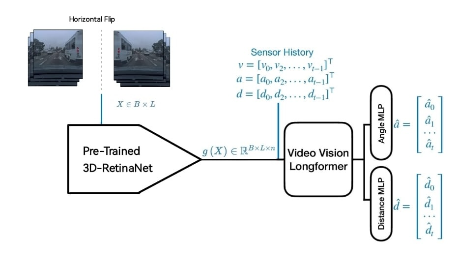

# BRAKE
Bottlenecked, Robust and Adaptable Knowledge of road Events: framework  for explainable autonomous driving

## Table of Contents

- [Introduction](#introduction)
- [Data Pre-processing](#data-pre-processing)
- [Model Architecture](#model-architecture)
- [How to Train and Test](#training-and-testing)
    - [Parameters](#explanation-of-the-command-parameters)
- [Results and Outputs](#results-and-outputs)
- [Collaborations](#collaborations)
- [Report](#report)
- [Acknowledgments](#acknowledgments)
- [References](#references)


---
## Introduction
Autonomous driving has made major advances thanks to deep learning, but most end-to-end models remain black boxes, limiting trust, safety, and adoption.

BRAKE (Bottlenecked, Robust and Adaptable Knowledge of road Events) tackles this by offering an explainable-by-design framework that replaces text-based concepts and [CLIP](#references) (used in [DCG](#references)) with:
- Structured [ROAD](#references) events for clearer and more reliable concept supervision,
- [3D-RetinaNet](#references) as concept encoder for robustness,
- Cross-dataset transfer learning from ROAD to [Comma2k19](#references).

This design enhances interpretability, robustness, and generalization, paving the way for more transparent and trustworthy autonomous driving systems.

## Data Pre-processing

We leverage the **Comma2k19** dataset, which captures diverse commuting scenarios in the San Francisco Bay Area. The dataset provides multimodal recordings, including visual frames, CAN bus signals (e.g., steering wheel angle), and radar measurements (e.g., distance to preceding vehicles). For our experiments, we work with a single chunk (~9 GB), subsampled at a rate of 1 frame every 5. Each driving sequence consists of 240 consecutive samples, resized to 224 × 224 pixels. The dataset is split into training, validation, and test sets using a 0.7/0.15/0.15 ratio, with uninformative sequences discarded (more than 20% zero values in key signals or shorter than 230 samples).

### Steps

1. **Download the dataset**  
   Download the first chunk (~9 GB) with:
   ```bash
   wget https://huggingface.co/datasets/commaai/comma2k19/resolve/431c287f12295222eb427a9cff821d63101f2169/Chunk_1.zip -O Chunk_1.zip
   ```

2. **Convert to HDF5**  
   Use the notebook [`BRAKE_convert_chunk1.ipynb`](./BRAKE_convert_chunk1.ipynb) in this repository to generate the train, validation, and test HDF5 files.


3. **Preprocess and compress**  
   With [`BRAKE_preprocess.ipynb`](./BRAKE_preprocess.ipynb), additional preprocessing can be applied to the HDF5 files, including compression to reduce file size.


## Model Architecture

BRAKE is a **Concept Bottleneck Model (CBM)** that maps raw sensory input to driving predictions via interpretable intermediate concepts, enhancing transparency and robustness.

The framework consists of:
- **Concept Bottleneck**: [3D-RetinaNet](#references) pretrained on [ROAD](#references) for detecting structured road events.
- **Temporal Encoder**: Longformer-based module capturing sequential dependencies; a [CLS] token summarizes the sequence.
- **Prediction Head**: MLP with GELU, dropout, and normalization predicts steering angle and vehicle distance; training uses RMSE loss with masking for uninformative targets.

**Cross-Dataset Transfer Learning**:
- Concept detector trained on [ROAD](#references), then transferred to [Comma2k19](#references).
- Horizontal flipping aligns left-hand (ROAD) and right-hand (Comma2k19) driving domains.

### Architecture Overview

Below is a schematic representation of the BRAKE framework:


## Training and Testing

The BRAKE framework can be trained on the [Comma2k19](#references) dataset using the scripts in the `sh_scripts` folder. Below is a representative example for training the model on the steering angle prediction task:

```bash
!python3 main.py -dataset comma -backbone none -concept_features -ground_truth normal -train -gpu_num 1 -max_epochs 100 -task angle -bs 2 -concept_source retinanet -train_concepts -seed 42
```

### Explanation of the command parameters:
- `-dataset comma` : specifies the [Comma2k19](#references) dataset as input.
- `-backbone none` : no additional backbone CNN is used; the model relies on concept features.
- `-concept_features` : enables the use of concept embeddings.
- `-ground_truth normal` : uses standard ground-truth values for supervision.
- `-train` : instructs the script to perform training.
- `-max_epochs 100` : sets the maximum number of training epochs to 100.
- `-task angle` : defines the task as steering angle prediction; can be `distance` or `multitask` as well.
- `-bs 2` : sets the batch size to 2.
- `-concept_source retinanet` : indicates that concepts are extracted via the [3D-RetinaNet](#references) module; can be `CLIP` as well.
- `-train_concepts` : enables the training of concept embeddings along with the main task.

- `-time_horizon` : sets the prediction horizon, i.e., the number of consecutive future steps the model predicts at each time step. This allows the model to perform autoregressive multi-step prediction, useful for capturing temporal dependencies in driving sequences. Used in testing only.

- `-checkpoint_path` : optionally specify a path to a pretrained checkpoint to resume training or for testing. If not provided, the script automatically searches for the latest checkpoint in the relevant training directory. During training, checkpoints are saved using `ModelCheckpoint`, including the best models and the last epoch, which can be used to resume training or for evaluation.


Other tasks such as distance prediction or multitask training (angle + distance) can be executed by changing the `-task` parameter, and training with different seeds can be done by modifying the `-seed` parameter. All related scripts are located in the `sh_scripts` folder.

## Results and Outputs

The performance of BRAKE is evaluated on the downstream tasks of **steering angle** and **leading vehicle distance** prediction. Accuracy is quantified using the **Mean Absolute Error (MAE)** over experiments conducted with three different random seeds (42, 123, 2025). Comparisons with a [CLIP](#references)-based concept encoder show that BRAKE, leveraging [3D-RetinaNet](#references) and structured visual concepts from [ROAD](#references), achieves superior performance on single-task predictions and comparable results on multitask predictions.

To assess robustness, Gaussian noise is added to input frames. Metrics such as **Jaccard Index** and **Rank-Biased Overlap (RBO)** are computed for top-k concepts (k=3,5,7), demonstrating that [3D-RetinaNet](#references) maintains higher stability and alignment under noisy conditions compared to [CLIP](#references).

### Available Analysis Scripts

The repository contains additional scripts and resources to reproduce all experiments reported in the paper:
- `analyse_results/` : scripts to compute and visualize evaluation metrics.
- `gradient_vis/` : scripts to generate attention and gradient-based visualizations.
- `noise/` : scripts to apply Gaussian noise to input frames and test robustness.

---

## Collaborations

This project was developed by [Leone Fabio](https://github.com/LeoneFabio), [Gabriele Raffaele](https://github.com/Gabriele-Raffaele) and [Giuseppe Vacante](https://github.com/Peppe2212).

---

## Report

For a detailed explanation of the methodology, experiments, results, and conclusions, refer to the [project report](./BRAKE.pdf).


## Acknowledgments

We would like to express our gratitude to the creators of the **[Comma2k19](#references)** and **[ROAD](#references)** datasets for providing high-quality data that made this research possible. We also thank the developers of the **[DCG](#references)** framework for inspiring and guiding the design of BRAKE.

## References

The following references correspond to the datasets and models used or mentioned in this project:

- **DCG (Driving through the Concept Gridlock)**: Echterhoff et al., "Driving through the concept gridlock: Unraveling explainability bottlenecks in automated driving," Proceedings of the IEEE/CVF Winter Conference on Applications of Computer Vision (WACV), pp. 7346–7355, January 2024.

- **ROAD Dataset**: Singh et al., "ROAD: The ROAD event awareness dataset for autonomous driving," IEEE Transactions on Pattern Analysis and Machine Intelligence, vol. 45, no. 1, pp. 1036–1054, 2022.

- **Comma2k19 Dataset**: Schafer et al., "A commute in data: The comma2k19 dataset," CoRR, abs/1812.05752, 2018.

- **CLIP (Contrastive Language–Image Pretraining)**: Radford et al., "Learning transferable visual models from natural language supervision," International Conference on Machine Learning (ICML), pages 8748–8763, PMLR, 2021.
